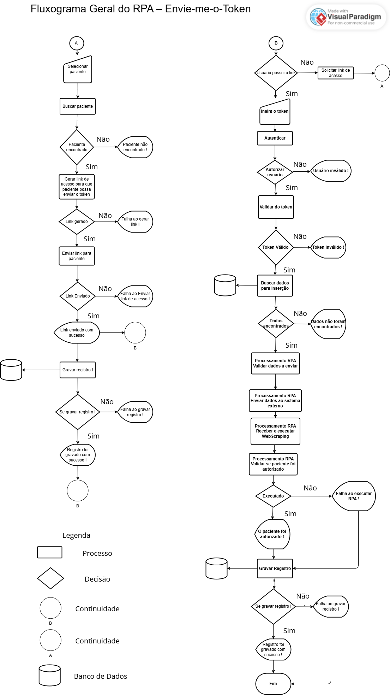
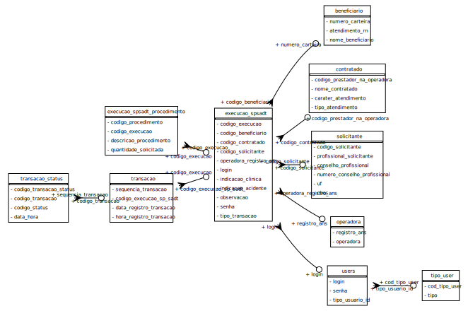
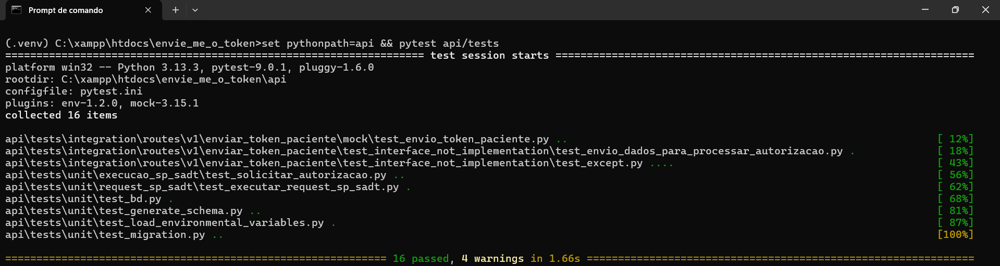

# Envie Me O Token -  Em desenvolvimento....

Automação será responsável por enviar dados do paciente para web service no padrão TISS para autorizar a sua sessão de tratamento automaticamente de acordo com os dados já pré-cadastrados agilizando o processo de atendimento do paciente.

Será criada uma interface para que o paciente possa enviar o token gerado em seu dispositivo, ao enviar , um RPA será acionado, onde enviará uma solicitação a um web service SOAP afim de autorizar a sessão para o paciente realizar o tratamento sem a necessidade da recepicionista precisar ficar inserindo as mesmas informações para cada autorização e cada sessão do paciente de forma manual e repetida, já que os dados do paciente são mantidos até a ultima sessão, e estes dados não mudam, o app mantém os dados do paciente já pré-cadastrados, aguardando somente o envio do novo token pelo paciente que se altera a cada sessão, assim o processo de atendimento para cada autorização do paciente na sessão, acaba se tornando mais agil para casos que o paciente tem um grande numero de sessões a se fazer.

# Objetivo deste projeto

Além de resolver um problema real, tem finalidade também de aplicar os conhecimentos já adiquiridos, como também ganhar novas experiências com os conhecimentos adiquiridos.

## O que este projeto espera alcançar.
- Uma análise profundas de documentações técnicas, desenvover com planejamento co  abertura de issues, desenvolver e entregar uma solução real.
- Entregar Fluxogramas de 2 RPAs(Geração de link automatico para usuário enviar o token e processo automatico de autorização do paciente para tratamento) que serão executados estabelecendo uma visão ampla de todo seu funcionamento.
- Compreensão de integração com web service SOAP
- Compreensão e Manipulação de arquivos/schemas XML.
- Compressão de leituras de documentação técnicas.
- Seguir padrões de comunicação estabelecidos pela ANS seguindo o padrão `TISS - Troca de Informação na Saúde Suplementar`
- Trabalhar com o padrão Abstract Factory
- Desenvolver o RPA orientado as testes `TDD - Test Driven Develoment` com `Pytest`
- - Testes conceituais/interfaces
- - Testes de Zombaria(Mocks)
- - Criar testes unitários
- - Criar testes de integração
- - Desenvolver a API que receberá o token enviado do usuário e os códigos de processamento dos RPAs.
- Trabalhar com `ORM - Object Relational Mapping` com `Flask-Alchemy`
- Geração de visualização gráfica do `DER - Diagrama Entidade-Relacionamento` com `Graphviz`
- Usufruir de Migrações com `Flask-Migration`
- Trabalhar com ambientes de `Teste`, `Homologação` e `Produção`.
- Desenvolver uma tela simples com `Webpack + Vue.js + Vuetify` que acionará o RPA.

# Fluxograma do RPA

Serão desenvolvidos 2 RPAs :

- O primeiro RPA com detalhe `A` do lado esquerdo vai gerar o link de acesso para o paciente poder acessar a tela que vai permitir que ele insera o token e envie. 
- Já o segundo RPA com detalhe `B` do lado direito, vai ser acionado a partir do momento que o paciente inserir o token e clicar no botão enviar na tela que será contruída posteriormente.

[](assets/fluxograma_RPA.png)

# Schema do Banco de Dados

Uma imagem do schema do banco de dados é gerado automaticamente a partir das models que foram criadas na pasta `api/src/models`.

Para gerar a imagem do schema do banco de dados automaticamente execute um dos seguintes comandos abaixo :

``` sh
    
    # Na raiz do projeto
    set pythonpath=api/src && python api/src/schema/generate_schema.py

    # Ou dentro da pasta interface
    cd interface
    npm run schema:bd

```

## Imagem do Schema

[](api/src/schema/db.svg)

Veja mais em [gerar schema do banco de dados](https://github.com/joseguilherme96/envie_me_o_token/tree/main/api/src/schema).

# Gerenciamento de ambientes com Dynaconf

Os ambientes development, testing, staging e production estão sendo gerenciados por Dynaconf trazendo facilidade para testes nos diferentes ambientes e implementação do app.

## Alternado entre ambientes

```sh

    Set ENV_FOR_DYNACONF = development # Windows : Default : development, opcionais : testing, staging or production

```


# Migração do banco de dados

```sh

    flask db migrate

```
# Executar o servidor Flask

```sh

    set pythonpath=api && flask run

```

# Execução dos testes de automatizados

Os testes estão sendo escritos com Pytest. Para executar os testes execute o seguinte comando :

```sh

set pythonpath=api && pytest api/tests #  Windows

export pythopath=api && pytest api/tests # Linux

```

[](assets/testes_automatizados_20251202.png)

## Execução de testes com Banco de dados MySQL

Ao executar os testes por padrão, os testes são executados utilizando o bancos de dados SQLite para mair rapidez nos testes, os teste podem ser alterados para um banco real utilizando a flag --dburl conforme exemplo abaixo.


```sh

    pytest api --log-cli-level=DEBUG --dburl=mysql+pymysql://root@localhost:3306/testing

```


# Execução do projeto via docker

Execute o seguinte comando :

```sh
    npm start
```

- O docker irá subir o banco de dados MySQL.
- Instalar as dependências do projeto.
- Subir o servidor Flask para desenvolvimento.


