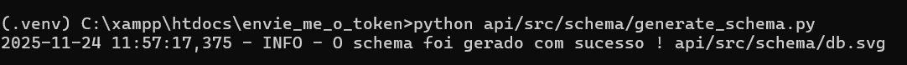
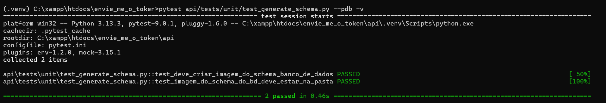

# Gerar Schema do Banco de Dados

Para gerar o schema de forma automática do banco de dados, foi utilizado a biblioteca `sqlalchemy_schemadisplay` que foi integrada app flask, possibilitando a geração de schema sem a necessidade de desenhar o schema de forma manual.

Para gerar o schema, digite o seguinte comando na raiz do projeto :

```sh

    set pythonpath=api && python api/src/schema/generate_schema.py

```

# Executando o comando que gera o schema do banco de dados:

[](../../../assets/geracao_imagem_schema_bd.png)

# Imagem do schema do banco de dados
[](db.svg)

# Testes

Para gerar os testes da geração da imagem do schema do banco de dados, execute o seguinte comando abaixo :

```sh

    pytest api/tests/unit/test_generate_schema.py --pdb -v

```

[](../../../assets/test_generate_schema.png)
